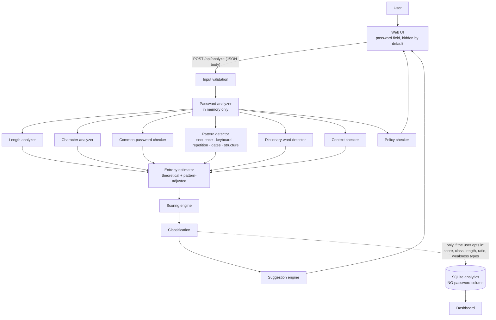

# Password Strength Analyzer & Security Suggestion Tool

> Privacy-focused cybersecurity tool for evaluating password strength using length, predictability, common-password checks, pattern analysis, entropy concepts, and personalized security recommendations.

   

---

## Overview

This web app analyzes a password **locally, in memory** and instantly returns:

- a 0–100 score and a VERY WEAK → VERY STRONG classification,
- *why*: length, character diversity, common-password matches, sequences, keyboard walks, repetition, dictionary words, word + number structures, years and dates, and optional personal-information overlap,
- specific suggestions, such as "Avoid keyboard walks such as qwerty", instead of "make it stronger",
- a theoretical entropy estimate **and** a pattern-adjusted estimate, so you can see why the formula alone misleads,
- a policy check (pass/fail) that is reported **separately** from strength.

The password is never stored, logged, echoed back or sent to any third party.

## Problem statement

Many sites still judge passwords with composition rules ("one uppercase, one number, one symbol"). Under those rules `Password123!` looks strong, yet it is one of the first things an attacker tries. People need feedback that reflects how guessing *actually* works: attackers start with common passwords, dictionary words, keyboard patterns, personal details and predictable tweaks.

## Objectives

1. Assess passwords using **length + unpredictability + pattern resistance + common-password checks + context**, not composition alone.
2. Explain every result: findings, a score breakdown, and entropy with its limitations.
3. Give specific, actionable suggestions and password-hygiene education.
4. Make privacy provable: no password column, no password in logs, URLs or browser storage, backed by automated tests.
5. Show secure-coding practice: input validation, rate limiting, security headers, CSPRNG generation, safe error handling.

## Cybersecurity relevance

Password quality directly affects resistance to **credential stuffing**, **password spraying**, and **offline guessing** after a breach. The same controls appear in registration forms, IAM platforms, banking and e-commerce sign-ups, and enterprise password policies. See [docs/PROJECT_EXPLANATION.md](docs/PROJECT_EXPLANATION.md) for the full background.

## Features

| Area | What it does |
|---|---|
| Real-time meter | Updates as you type (debounced), with a hidden-by-default field and a show/hide toggle |
| Pattern map | Draws the password as tiles underlined by pattern type, so you can see *where* it is predictable. Characters show only when "Show password" is on, and they come from the local field, never from the server |
| Length analysis | Educational bands: <8 very short, 8–11 short, 12–15 better, 16+ strong contribution |
| Character analysis | Classes, unique-character count and ratio, estimated pool size |
| Common passwords | Local list, including leetspeak variants (`p@ssw0rd1` → `password1`) |
| Patterns | Ascending/descending sequences, keyboard walks (QWERTY/QWERTZ/AZERTY rows, columns, keypad), repeated characters and substrings, years and dates, dictionary words, "word + number/symbol" structures |
| Personal context | Optional demo name / birth year / organization, compared in memory and never stored |
| Entropy | `L × log₂(N)` theoretical estimate plus a pattern-adjusted estimate |
| Guess resistance | Four illustrative attacker scenarios, clearly labelled *educational estimate only* |
| Scoring | Transparent 0–100 breakdown: contributions, penalties, caps |
| Suggestions | Specific to the findings, plus hygiene advice (unique passwords, password manager, MFA) |
| Generator | `secrets`-based random passwords (16/20/24) and example passphrases |
| Policy checker | Admin-configurable minimum length, common-password block, personal-info block, spaces |
| Dashboard | Aggregate, password-free statistics with 5 charts and table fallbacks |
| Hashing demo | Separate Argon2id `hash_password()` / `verify_password()` demo using a synthetic password |

## Architecture



The password never crosses the dotted line. Only allow-listed metadata reaches storage. Details: [docs/ARCHITECTURE.md](docs/ARCHITECTURE.md).

## Technology stack

| Layer | Choice | Why |
|---|---|---|
| Backend | Python 3.10+ / Flask 3 | Readable, beginner-friendly, easy to test |
| Frontend | HTML, CSS, vanilla JavaScript | No build step; served by Flask (same origin, no CORS) |
| Analytics | SQLite | Zero-setup, file-based, fine for aggregate metadata |
| Charts | Chart.js 4 (jsDelivr) | Simple; tables still work if the CDN is unavailable |
| Hashing demo | argon2-cffi (Argon2id) | OWASP-recommended password hashing |
| Tests | pytest | 73 automated tests |

A React + FastAPI alternative is discussed in [docs/ARCHITECTURE.md](docs/ARCHITECTURE.md#technology-choice).

## Password analysis

`analyze_password(password, context=None)` in [backend/services/password_analyzer.py](backend/services/password_analyzer.py) returns:

```json
{
  "score": 25,
  "classification": "WEAK",
  "findings": [{"type": "keyboard_pattern", "severity": "high", "title": "Keyboard pattern", "description": "..."}],
  "suggestions": ["Avoid keyboard walks such as qwerty, asdf or 1qaz - ..."],
  "metrics": {"length": 11, "theoretical_entropy_bits": 67.2, "adjusted_entropy_bits": 23.3, "...": "..."},
  "checks": [{"label": "Keyboard pattern", "passed": false}],
  "policy": {"status": "POLICY FAIL", "rules": ["..."]}
}
```

### Length analysis
Length contributes up to 35 points (linear, full at 20 characters). Length alone is not enough: `aaaaaaaaaaaaaaaa` is 16 characters and still scores **WEAK**, because the repetition detector and the entropy ceiling catch it.

### Pattern detection
[backend/services/pattern_detector.py](backend/services/pattern_detector.py): `detect_sequences()`, `detect_keyboard_patterns()`, `detect_repetition()`, `detect_dates()` and `detect_predictable_structure()`. Every detector returns **positions and lengths only**, never the matched characters.

### Common-password detection
[data/common_passwords.txt](data/common_passwords.txt) is a small educational list of generic, widely published weak passwords. It contains no leaked credentials and no personal data. Matches display: *"Your password matches a commonly used password pattern and should not be used."*

### Entropy estimation
- **Theoretical:** `Entropy ≈ L × log₂(N)`. This assumes random selection, so it gives `Password123!` about 79 bits.
- **Pattern-adjusted:** each pattern is re-priced at roughly its cost to an attacker, which gives `Password123!` about 23 bits.

Both are estimates. **No single formula can perfectly determine password strength.**

### Strength scoring
Contributions: length (35), character diversity (15), unique-character ratio (10), pattern resistance (20), not a common password (10), additional unpredictability (10). Penalties per weakness type are combined with diminishing weights (1, ½, ¼ …) so overlapping findings aren't double-counted. Caps: a common password scores at most 10; length under 6 at most 20 (under 8 → 30, under 10 → 55, under 12 → 75); and there is an entropy ceiling of 15 + adjusted bits.

| Score | Class |
|---|---|
| 0–20 | VERY WEAK |
| 21–40 | WEAK |
| 41–60 | MODERATE |
| 61–80 | STRONG |
| 81–100 | VERY STRONG |

> These are **project-defined** educational bands, not a universal security standard.

### Security suggestions
[backend/services/suggestion_engine.py](backend/services/suggestion_engine.py) maps each finding to specific advice, adds length guidance, and always ends with hygiene advice: unique passwords, a password manager, and MFA. Suggestions never quote the password.

### Password generator
[backend/services/password_generator.py](backend/services/password_generator.py) uses Python's `secrets` module, a CSPRNG. It never uses `random`, whose Mersenne Twister output is predictable. Generation guarantees one character from each selected class and uses a `SystemRandom` shuffle. Nothing generated is stored.

### Password policy checker
Configurable in `.env` (`POLICY_MIN_LENGTH`, `POLICY_COMMON_PASSWORD_CHECK`, `POLICY_PERSONAL_INFO_CHECK`, …). The check shows **POLICY PASS / POLICY FAIL** separately from the strength score. `Welcome2026!` passes the default policy and is still WEAK. That's the point.

## Privacy design

| Rule | How it is enforced | Proven by |
|---|---|---|
| Never store the password | No password column; an allow-list builds each stored record | `test_T28`, `test_T30` |
| Never log the password | App code never logs it; a `RedactionFilter` backs that up | `test_T29`, `test_redaction_filter…` |
| Never echo the password | Findings contain positions and types only; errors are generic | `test_password_not_in_api_response`, `…error_messages` |
| Never put it in a URL | POST with a JSON body; query strings are rejected | `test_password_never_sent_in_url…`, `…query_string` |
| No browser persistence | No local/session storage or cookies; fields clear on `pagehide` | `test_frontend_avoids_browser_storage…` |
| No third parties | All lists are local files; no external API calls | code review |
| No caching | `Cache-Control: no-store` on every API response | `test_security_headers` |
| Real-time typing never reaches analytics | Real-time calls send `record: false`; saving is an explicit button | code + UI |

## Installation

```bash
git clone https://github.com/SNischayPrasad/Password-Strength-Analyzer-Security-Tool.git
cd Password-Strength-Analyzer-Security-Tool
python -m venv .venv
```

Activate the virtual environment. On Windows (PowerShell): `.venv\Scripts\Activate.ps1`. On macOS/Linux: `source .venv/bin/activate`.

```bash
pip install -r requirements.txt
cp .env.example .env        # optional; the defaults work without it
```

## Usage

```bash
python -m backend.app
```

Open **http://127.0.0.1:5000**. The same server hosts the frontend, so there is no separate frontend server to start.

- **Analyzer:** type a demo password such as `Password123!` or `qwerty2026!`.
- **Generator:** scroll to *Let a machine choose*.
- **Dashboard:** http://127.0.0.1:5000/dashboard. Load synthetic demo data with `python scripts/seed_demo_data.py --reset`.
- **Learn:** http://127.0.0.1:5000/learn.
- **CLI (hidden input):** `python scripts/analyze_cli.py`.
- **Hashing demo:** `python demos/hashing_demo.py`.

## API documentation

| Method | Endpoint | Purpose |
|---|---|---|
| POST | `/api/analyze` | Analyze `{"password": "...", "context": {...}, "record": false}` |
| POST | `/api/generate-password` | `{"length": 20, "uppercase": true, "lowercase": true, "digits": true, "symbols": true}` |
| POST | `/api/generate-passphrase` | `{"word_count": 6, "separator": "-"}`, for examples only |
| GET | `/api/dashboard/stats` | Aggregate statistics (no passwords) |
| GET | `/api/analytics/weaknesses` | Weakness-type frequencies |
| GET | `/api/policy` | Active policy |
| GET | `/api/health` | Liveness |

Status codes: `200` OK, `400` invalid input, `404`/`405` wrong endpoint or method, `413` body too large, `415` not JSON, `429` rate-limited (with `Retry-After`), `500` generic error. Full reference: [docs/API.md](docs/API.md).

## Testing

```bash
python -m pytest -v
```

**73 tests pass**, including the 30 required scenarios (T01–T30) and a privacy/security suite. See [docs/TESTING.md](docs/TESTING.md) for the table with inputs, expected results and actual results.

## Security testing

Automated checks verify that the password is not stored (the raw database bytes are scanned), not logged, not returned, not accepted via the URL, typed into a `type="password"` field, and never written to local/session storage or cookies. They also check that the generator imports `secrets`, not `random`, and that debug mode is off by default. See [docs/TESTING.md#security-testing](docs/TESTING.md#security-testing).

## Results

| Synthetic input | Score | Class | Main reasons |
|---|---|---|---|
| `123456` | 0 | VERY WEAK | Common password, sequence, short, digits only |
| `Password123!` | 38 | WEAK | Dictionary word + "123" + "!", despite four character types |
| `aaaaaaaaaaaaaaaa` | 24 | WEAK | Long but ~100% repetition |
| `qwerty2026!` | 25 | WEAK | Keyboard walk + year + word/number structure |
| Random 20 chars (generated at runtime) | ~98 | VERY STRONG | No patterns, ~131 bits |
| Random 6-word passphrase | ~86 | VERY STRONG | Random words, passphrase detected |

## Limitations

- Word lists are small and educational. Real attackers use corpora with billions of entries. A password scoring well here can still be weak if it appears in a breach.
- Entropy numbers are estimates under simplified attacker models.
- The keyboard patterns cover common layouts only.
- The in-memory rate limiter protects a single process only.
- Python strings can't be securely wiped from memory. We minimize their lifetime but can't guarantee erasure.
- Guess-time figures are illustrative, not predictions.

## Future improvements

zxcvbn-style full pattern matching; privacy-preserving breach checks (k-anonymity range queries, opt-in only); configurable enterprise policies; IAM/SSO integration concepts; passkey/WebAuthn education; localization; deeper accessibility work; organization-level aggregate reporting without collecting passwords. See [reports/PROJECT_REPORT.md](reports/PROJECT_REPORT.md#25-future-scope).

## Documentation

| Document | Contents |
|---|---|
| [docs/LOCAL_SETUP.md](docs/LOCAL_SETUP.md) | Exact step-by-step commands (Steps 1–10) and safe demo cases |
| [docs/PROJECT_EXPLANATION.md](docs/PROJECT_EXPLANATION.md) | Concepts (simple and technical), industry relevance, roles, fundamentals, brute-force concepts, 10 rules, login security |
| [docs/ARCHITECTURE.md](docs/ARCHITECTURE.md) | Architecture, folder guide, database design, stack comparison |
| [docs/API.md](docs/API.md) | REST API reference, status codes, privacy notes |
| [docs/TESTING.md](docs/TESTING.md) | T01–T30 results table and security testing |
| [docs/GITHUB_STRATEGY.md](docs/GITHUB_STRATEGY.md) | Git commands, commit plan, screenshot checklist |
| [docs/CAREER_KIT.md](docs/CAREER_KIT.md) | Resume bullets, LinkedIn text, 10 interview Q&As |
| [reports/PROJECT_REPORT.md](reports/PROJECT_REPORT.md) | Full project report |

## Screenshots

See [screenshots/README.md](screenshots/README.md) for the capture checklist and file names. Use **synthetic passwords only**.

| Analyzer | Dashboard |
|---|---|
| `screenshots/03_analyzer_homepage.png` | `screenshots/19_analytics_dashboard.png` |

## Learning outcomes

- How attackers actually guess passwords, and why composition rules fall short
- Entropy, and where it misleads
- Password storage: salting, Argon2id/bcrypt/scrypt/PBKDF2, hashing vs encryption
- Secure API design: validation, rate limiting, headers, safe errors, no-store caching
- Privacy by design and data minimization, proven with tests
- Building a modular, tested Python service

## Security disclaimer

This is an **educational, defensive** tool. It does not crack passwords or attempt logins, and it doesn't send passwords anywhere. Scores are project-defined estimates, and no tool can guarantee a password is secure. Use synthetic passwords for demos and screenshots, and never share your real passwords with any tool you don't control. Always combine strong, unique passwords with a password manager and MFA.

## Author

**Sadhanala Nischay Prasad**. Cybersecurity student
GitHub: `https://github.com/SNischayPrasad` · LinkedIn: `https://linkedin.com/in/<your-profile>`
